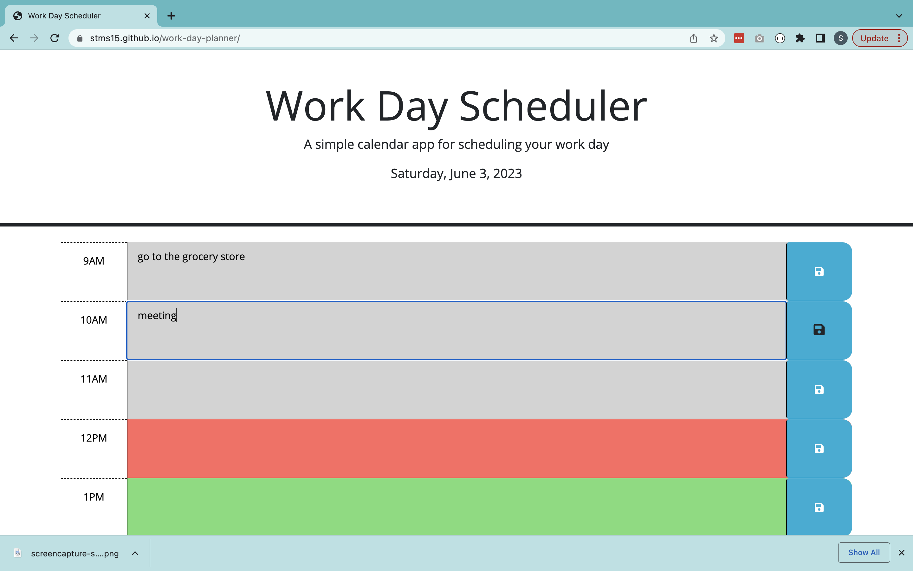
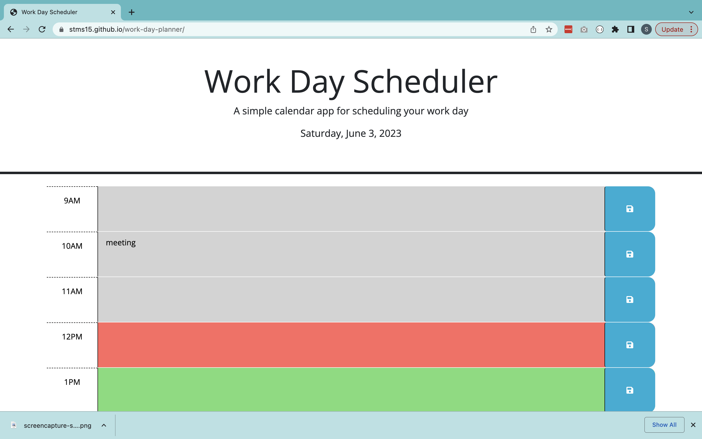
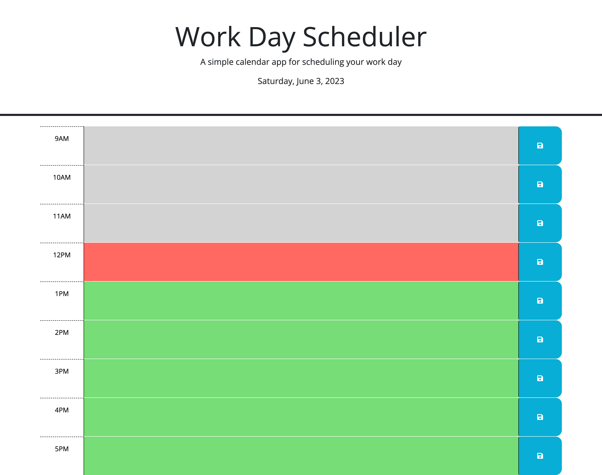

# Work Day Planner

## Description

This project uses JQuery and Day.js to update a 9-5 schedule for the current day when an event is changed and the corresponding save button is clicked.

There is a listener that detects a change in the `<textarea>` HTML element for each hour. When changed, the updated value of the textarea is stored in an array. There are also listeners for each save button that triggers a function on click to store locally the corresponding `<textarea>`'s updated text only. The save button only saves the changes made to that particular hour - if multiple text boxes are updated, but only one hour's save button is clicked, only that hour will save and the rest will not.

Then, on refresh, the data stored locally is retrieved for each hour using the element id. If the stored text isn't emtpy or null, the corresponding `<textarea>` is populated with the saved values.

Working on this project introduced me to a new listener type: `element.on("change", function(){})`.
I also got more comfortable using JQuery and DOM traversal by having to access and add listeners to the `<textarea>` and `<button>` elements within each hour's `
`.

## Table of Contents

- [Installation](#installation)
- [Usage](#usage)
- [Credits](#credits)
- [License](#license)

## Installation

N/A

## Usage

You can access the deployed application here: https://stms15.github.io/work-day-planner/.

You can use the site to schedule daily events and activities for each hour of the work day. It is a planner for the current date only, which will be displayed at the top of the screen.

To add or change an event, click on a box and start typing. Grey boxes are in the past, red is the current hour, and green boxes are future events.

To save events, click the blue save button to the right of each event. Note that events will only save for the corresponding box. That is, if there is an event in the 9am box and one in the 10am box, but only the save button for 10am was clicked, then the 9am event will not be saved after the current session is closed or refreshed. A demonstration of this can be seen in the photos below.

 

A screenshot of the entire website can be seen below.

## Credits

A colleague, Tim Carew (https://github.com/timcarew), and the JQuery documentation (https://api.jquery.com/change/) helped to successfully implement on change listeners for the `<textarea>`'s in this project.

## License

&copy; 2023 Sarah Stone

There is currently no license for this project as use of the code is not yet permitted. If you wish to use the code, please reach out to me directly.

---

## Badges

